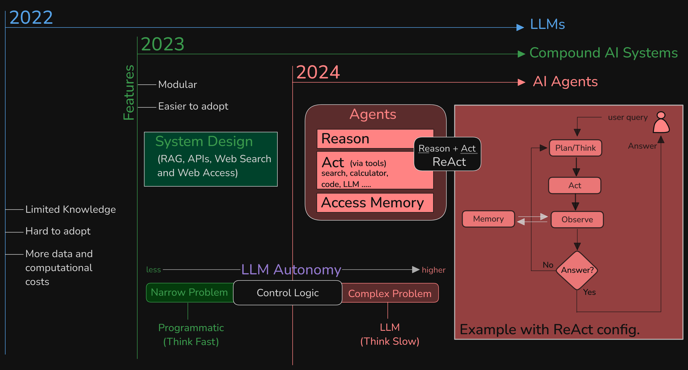

# Compound AI Systems: A New Frontier in AI

[The Shift from Models to Compound AI Systems](https://bair.berkeley.edu/blog/2024/02/18/compound-ai-systems/)

[Watch: The Future of AI: Unleashing the Power of Compound Systems](https://www.youtube.com/watch?v=5QIpc6hKaKg)

[Watch: The Shift from Large Language Models(LLMs) to Compound AI Systems](https://www.youtube.com/watch?v=IaMOZq1O7JI)

[What Are Compound AI Systems?](https://www.databricks.com/glossary/compound-ai-systems)

[Why Compound AI Systems is the Future of Complex Problem-Solving](https://ashishjaiman.medium.com/why-a-compound-ai-systems-is-the-future-of-complex-problem-solving-bd7be16ed57f)

**Compound AI systems** represent a significant shift in the way we approach AI development. Instead of relying on a single, monolithic model, these systems combine multiple AI models, tools, and techniques to create more robust, flexible, and efficient solutions to complex problems.

Compound AI systems are an emerging trend in artificial intelligence that involve integrating multiple AI components to tackle complex tasks more effectively. Unlike traditional AI models that rely on a single model, compound AI systems combine various models, retrievers, databases, and external tools to enhance performance, flexibility, and robustness¹².

This approach allows for better performance by leveraging the strengths of individual components, making the systems more adaptable and resilient. It's a significant shift from focusing solely on scaling up models to strategically assembling multi-component systems.

### Why Compound AI is Gaining Traction:

* **Overcoming limitations of single models:** Single models often struggle with complex, real-world problems. Compound AI systems address this by breaking down problems into smaller, manageable components.
* **Improved efficiency and resource utilization:** By specializing different components, compound AI systems can optimize resource usage and reduce computational costs.
* **Increased flexibility and scalability:** The modular architecture allows for easy integration of new models and components, making the system adaptable to changing requirements.

### Real-World Applications:

The potential applications of compound AI systems are vast and span across various industries:

* **Healthcare:** Drug discovery, medical image analysis, personalized treatment plans
* **Finance:** Fraud detection, risk assessment, algorithmic trading
* **Autonomous vehicles:** Perception, decision-making, control
* **Natural language processing:** Advanced chatbots, language translation, sentiment analysis

**In essence, compound AI systems mark a paradigm shift in AI development, promising to deliver more sophisticated, reliable, and effective solutions to a wide range of challenges.**

## LLMs -> Compound AI Systems -> AI Agents

**We are witnessing a shift from LLMs to compound AI systems, and eventually, to [AI agents](https://www.youtube.com/watch?v=F8NKVhkZZWI).**

The evolution of artificial intelligence (AI) is marked by a progression from isolated models to integrated systems capable of autonomous decision-making and action execution. This journey encompasses three distinct stages:

1. **Large Language Models (LLMs):** These are advanced AI models trained on extensive text data to generate human-like language, serving as foundational tools for various applications.

2. **Compound AI Systems:** These systems combine multiple AI components and external resources to perform complex tasks, enhancing flexibility and control.

3. **AI Agents:** Building upon compound systems, AI agents operate autonomously, interacting with their environment to achieve specific goals, representing a significant advancement in AI capabilities.

**Large Language Models (LLMs):**

LLMs, such as OpenAI's GPT series, are trained on vast datasets to understand and generate human-like text. They excel in tasks like language translation, summarization, and content creation. However, their functionality is limited to processing and generating text based on input prompts, without the ability to perform actions or interact with external systems.

**Compound AI Systems:**

Compound AI systems integrate multiple AI models and external tools to tackle more complex tasks. By combining components like databases, code interpreters, and permission systems, these systems become more dynamic and flexible than individual models. This modular approach allows for better control and trust, as each component can be updated or replaced independently to adapt to new data or changing requirements. 

**AI Agents:**

AI agents represent a further evolution, embodying autonomous systems that can perceive their environment, make decisions, and execute actions to achieve specific objectives. They utilize LLMs for decision-making and can interact with various tools and APIs to perform tasks such as booking appointments, managing emails, or controlling smart devices. This autonomy enables them to operate without continuous human input, making them versatile in dynamic environments. 

**Transition from LLMs to AI Agents:**

The shift from LLMs to AI agents involves enhancing AI systems with capabilities beyond text generation:

- **Integration with External Systems:** AI agents can access databases, execute code, and interact with APIs, allowing them to perform a broader range of tasks.

- **Autonomous Decision-Making:** Unlike LLMs that respond based on predefined prompts, AI agents can make decisions and take actions aligned with their goals.

- **Environmental Interaction:** AI agents can perceive and respond to changes in their environment, enabling them to adapt their actions accordingly.

**Implications for the Future:**

The development of AI agents signifies a move towards more autonomous and intelligent systems capable of handling complex, multi-step tasks across various domains. This progression enhances efficiency and opens new possibilities for AI applications in areas such as customer service, healthcare, and personal assistance.

In summary, the evolution from LLMs to compound AI systems and ultimately to AI agents reflects the growing sophistication and autonomy of AI technologies, paving the way for more integrated and capable systems in the future. 

